# cinema_base

## Документация

## 1. Запуск проекта

В пропертях проекта для подключения к БД используются параметры типа: ${POSTGRESQL_SERVER}

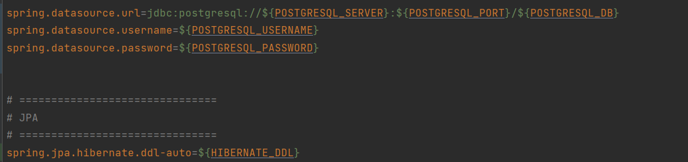

Их можно прописать в конфигурации проекта

1 шаг  
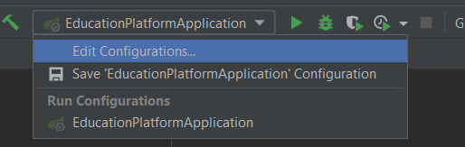

2 шаг  

## 2. Создание merge request

### 2.1. Создание merge request через карточку
Открываем за асигненую за вами карточку  
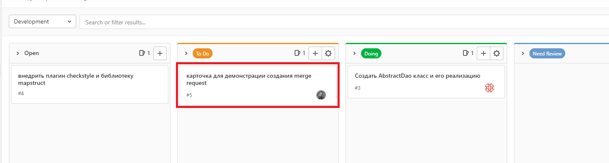

Перед созданием мердж реквеста необходимо задать осмысленное(!) название для ветки,
для этого открой мердж реквест(1), пропишите имя для ветки(2) и убедитесь,
что новая ветка будет создана от **main** ветки(3) (**в данном проекте вместо dev ветки используется main**)
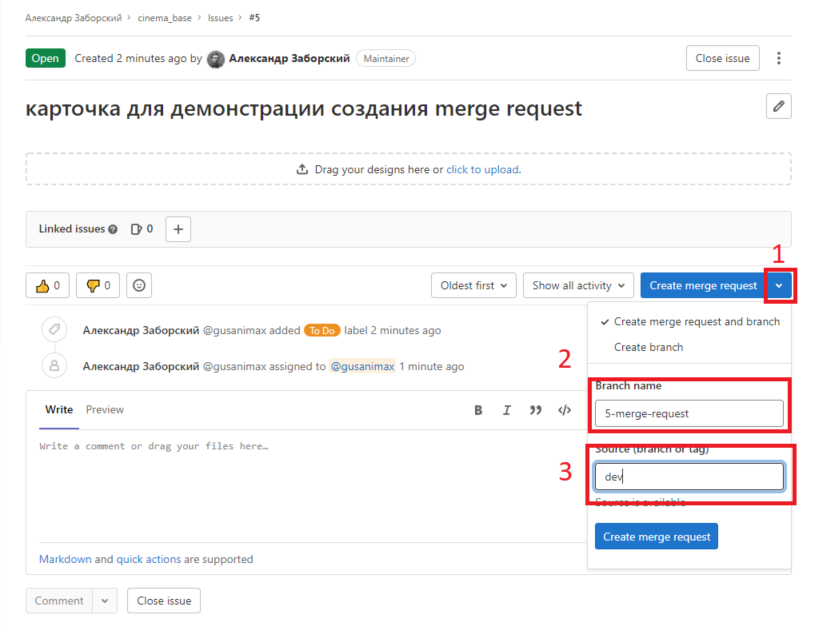

В мердж реквесте в разделе **Overview**(1) будут отображаться замечания к коду,
свои изменения можно будет посмотреть в разделе **Changes**(2),
созданная ветка и куда она будет мерджиться можно будет посмотреть в блоке (3),
в случае если мердж реквест нужно изменить, это можно сделать в кнопке **Edit**(4),
после выполнения задания обязательно нажимайте кнопку **Mark as ready**(5),
в гитлабе за асигненые за вами карточки можно просмотреть по кнопке справа в виде
карточек(6), а ваши мердж реквесты в кнопке в виде веток(7)
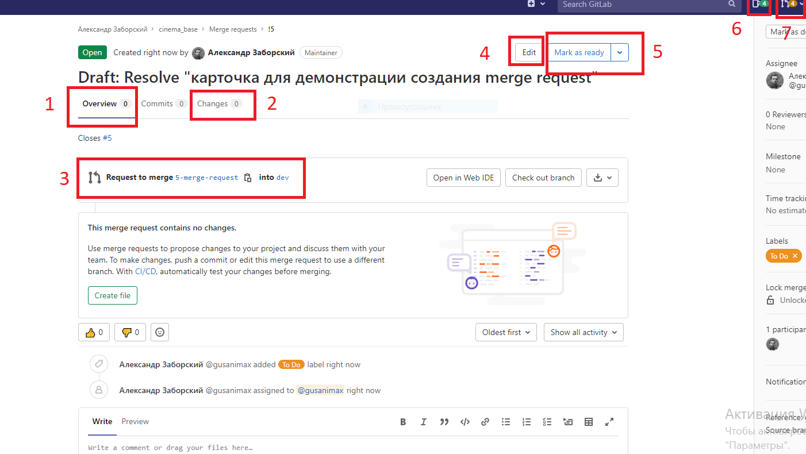

### 2.2. Создание merge request если уже создана ветка
Нажмите на вкладку **Merge request** слева (1), нажмите на кнопку **New merge request** (2)
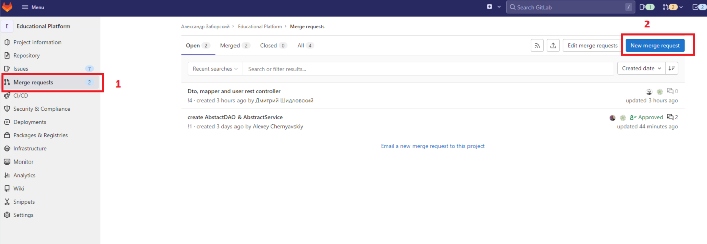

На открывшейся странице выберите в сурса свою ветку (1), проверьте, что в ветке куда вы собрались мерджить свои изменения стоит **main** (2)  ,
нажмите кнопку **Compare branches and continue** (3)

На новой странице в селекторе **Assignee** выберите себя (1), в селекторе **Reviewer** выберите проверяющего (2). Проверьте, что стоит чекбокс на удаление после мерджа (3), нажмите кнопку **Create merge request** (4).

### **После создания реквеста приложите ссылку на него в карточку в комментариях**!!!!!!!!!!!!!!

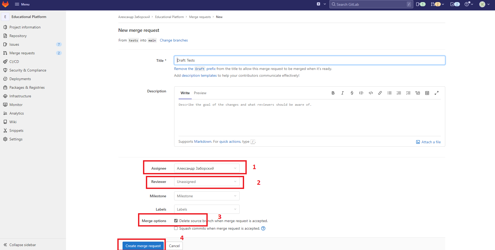

## 3. Подготовка к пушу своей ветки
Прежде чем запушить свои изменения, необходимо подготовить ветку к отправке.

Чтобы иметь на руках актуальную версию проекта, необходимо обновить мастер-ветку,
это нужно делать каждый раз перед отправкой задачи на проверку
Для этого нажмите на текущую ветку в правом нижнем углу. Выберите опцию **main | update**.
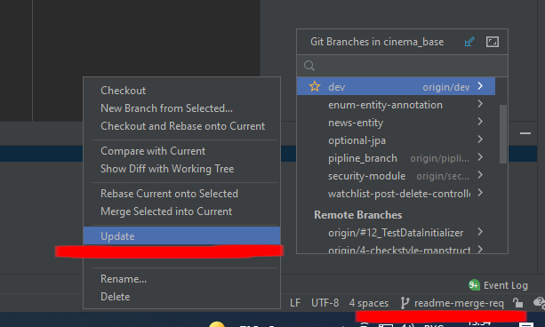

Чтобы подтянуть все смерженные коммиты в локальную ветку, в которой вы работаете, нужно:
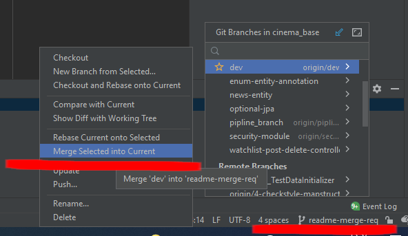

## 4. Получение JWT токена.
/api/registration - регистрируем нового пользователя (по умолчанию получает роль USER)
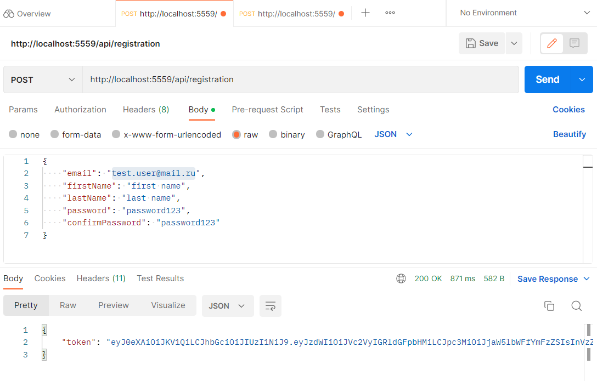
/api/authentication - отправлеям логин и пароль только что зарегистрированного
пользователя или существующего из БД. В ответе получаем JWT - токен.
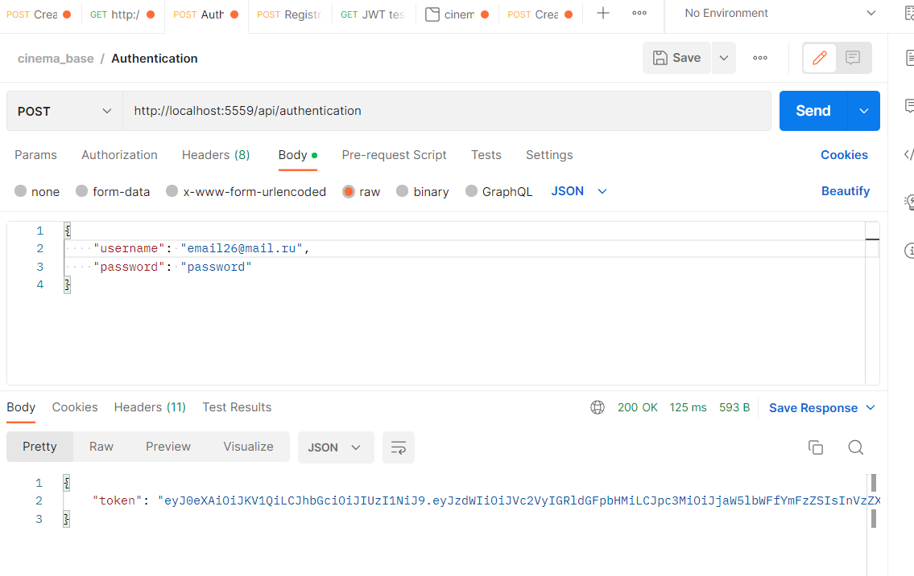
Копируем полученный токен и вставляем во вкладку Authorization Type: Bearer Token, в конце запроса
должен быть указан Id пользователя, который получил токен
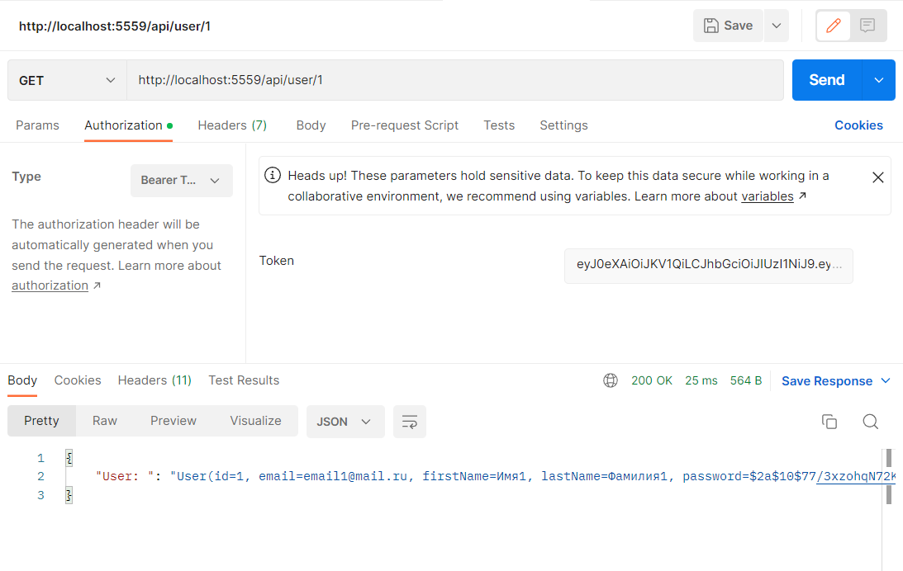
Авторизованные реквесты:
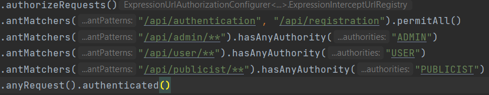

## 6. JPA Buddy
Для внесения изменений в БД при изменении сущностей.
На вкладке JPA Structure (1), выбираем Liquibase (2) и Diff Changelog (3)
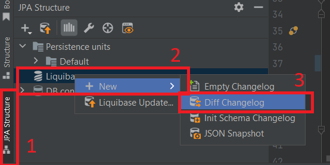
В следующем диалоговом окне должна быть выбрана наша модель (4) и соединение с БД (5)
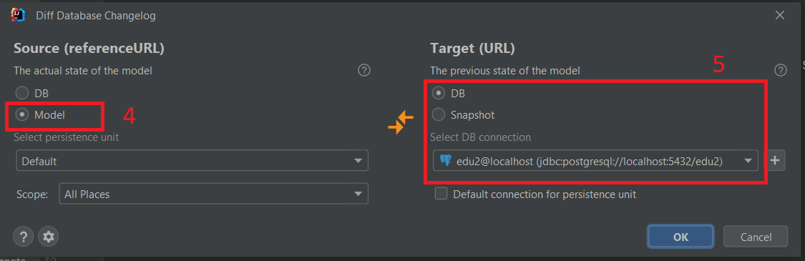
Дирректорию выбираем: следующая свободная версия вида vXXX (6)
Имя файла (7)
Тип файла миграции SQL (8)
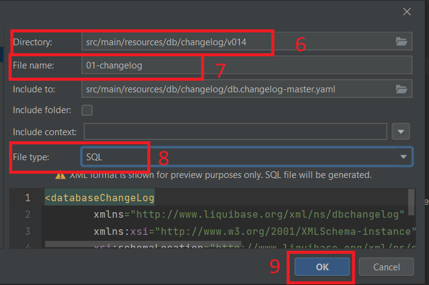
В файл db.changelog-master.yaml (10) добавляем нашу новую дирректорию с миграцией
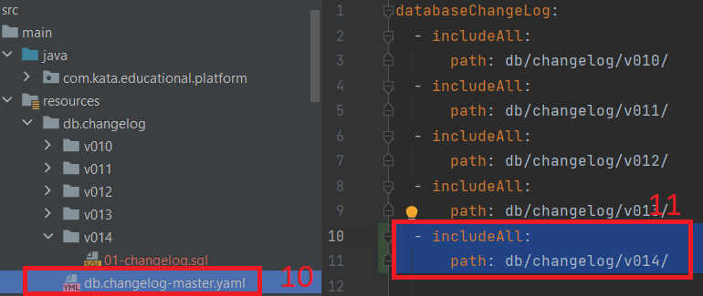

## 7. Правила написания интеграционных тестов
* Тесты создаются согласно методам в рест контроллерах, на каждый рест контроллер создается свой пакет, на каждлый метод в рест контроллере создается класс в котором на этот самый метод пишутся тесты с разными случаями отработки, в датасетах также на каждый контроллер создается свой пакет, в этом пакете на каждый метод создается еще один пакет в котором уже и пишутся датасеты, допускатеся создангие разных пакетов на один метод в случае необходимости
* Датасеты пишутся в виде sql файлов
* Id сущностей написанных в датасетах желательно начинать с 100
* На каждый класс создается свой пакет с датасетами, стоит избегать изменения в уже написанных датасетах, если нужны дополнительные данные, необходимо создать подпакет и уже в нем описывать нужные данные
* В тестах не используется аннотация @Transactional.
* Для отправки dto использовать ObjectMapper

## Описание сущностей
(ссылка на диаграмму - https://dbdiagram.io/d/61f1b1147cf3fc0e7c6dce0e)

### users - `таблица обозначающая пользователя в система`
- id - уникальный идентификатор
- email - почта
- first_name - имя
- last_name - фамилия
- password - пароль
- birthday - дата рождения
- role_id - идентификатор роли

### roles - `определяет права пользователя в системе`
- id - уникальный идентификатор
- name - наименованеи роли

### user_avatar - `таблица для сохранения пути к аватарке пользователя`
- user_id - идентификатор пользователя
- avatar_url - путь к аватару пользователя

### news - `определяет медия новости`
- id - уникальный идентификатор
- rubric - рубрики для статей, может принимать следующие значения NEWS, TESTS, TRAILERS, SERIALS, INTERVIEW, VIDEO, ARTICLE, PODCASTS
- date - дата публикации
- title - заголовок
- html_body - содержание статьи
- user_id - идентификатор пользователя

### score - `таблица отвечающая за оценку пользователей на фильм`
- id - уникальный идентификатор
- movie_id - уникальный идентификатор фильма
- user_id - уникальный идентификатор пользователя
- score - оценка

### movie - `таблица отвечающая за фильмы/сериалы`
- id - уникальный идентификатор
- name - наименование
- countries - страны производства
- date_release - дата выхода
- rars - возрастная классификация информационной продукции в России
- mpaa - система рейтингов Американской киноассоциации
- time - продолжительность фильма
- desciption - описание фильма
- type - тип сериал/фильм, принимает следующее значение MOVIES, SERIALS
- origin_name - оригинальное наименование фильма

### content - `таблица отвечающая за хранение путей к превьюшкам, кадрам, трейлерам фильмов`
- id - уникальный идентификатор
- movie_id - идентификатор фильма
- content_url - путь к контенут
- type - тип, может принимать следующие значения MOVIES, SERIALS, PREVIEW, FRAME, TRAILER

### genres - `таблица отвечающая за жанры фильмов`
- id - уникальный идентификатор
- name - имя жанра

### collections - `подборки фильмов`
- id - уникальный идентификатор
- name - наименование подборки
- enable - отвечает за отображение подборки

### awards_ceremony_result - `результаты церемонии награждения`
- id - уникальный идентификатор
- person_id - уникальный идентификатор пользователя
- movie_id - уникальный идентификатор фильма
- nomination_id - уникальный идентификатор номинации
- awards_ceremony_id - уникальный идентификатор церемонии награждения
- nomination_status - статус номинации, может принимать следующие параметры: NOMINATED, WINNER

### awards_ceremony - `церемония награждения`
- id - уникальный идентификатор
- date_event - дата проведения
- place_event - место проведение
- award_id - уникальный идентификатор награды

### awards - `награда`
- id - уникальный идентификатор
- name - название (к примеру, золотой глобус, оскар, сезар и т.д.)
- place_event - место проведение
- award_id - уникальный идентификатор награды

### nomination - `номинация`
- id - уникальный идентификатор
- name - название номинации

### professions - `деятельность в кино`
- id - уникальный идентификатор
- name - наименование

### movie_person - `связующая таблица для обозначение ролей в фильме/сериале`
- movie_id - уникальный идентификатор фильма
- profession_id - уникальный идентификатор професии
- person_id - уникальный идентификатор персоны
- type_character - тип персонажа в фильме/сериале, может принимать следующие значения MAIN_CHARACTER, MINOR_CHARACTER, NO_CHARACTER_MOVIE
- name_role - наименование роли в фильме, может быть null

### persons - `знаменитости разной деятельности в кино`
- id - уникальный идентификатор
- first_name - имя
- last_name - фамилия
- height - рост
- date_birth - дата рождения
- место рождения

### folders_movies - `пользовательские папки для отслеживание фильмов`
- id - уникальный идентификатор
- category - категории, могут принимать следующие значения WAITING_MOVIES("Буду смотреть" ), FAVORITE_MOVIES("Любимые фильмы" ), VIEWED_MOVIES("Просмотренные" ), CUSTOM("Новый список" )
- user_id - уникальный идентификатор пользователя
- privacy - доступность папки для других пользователей, может принимать следующие параметры PRIVATE, PUBLIC
- name - имя для собственных папок
- description - описание

### folders_persons - `пользовательские папки для отслеживание персон`
- id - уникальный идентификатор
- favourites - флаг для избранного фолдера поумолчанию
- user_id - идентификатор пользователя
- privacy - доступность папки для других пользователей, может принимать следующие параметры PRIVATE, PUBLIC
- name - имя для собственных папок
- description - описание